# Containerized-Dynamic-Web-Application-on-AWS-and-ECS

## Overview
I containerized and deployed a production-ready web application on AWS using 
Docker and Amazon ECS (Fargate), with high availability, auto-scaling, secure 
networking, and automated data migration — following industry best practices 
for security and reliability.

---

## What Did I Build?
I build a fully containerized web application infrastructure on AWS that includes:
- A secure, multi-tier VPC network
- Containerized application running on ECS Fargate (serverless)
- MySQL database on Amazon RDS (Multi-AZ ready)
- HTTPS-enabled Application Load Balancer with SSL termination
- Auto-scaling based on CPU utilization
- Automated database migration using EC2 and AWS Secrets Manager
- Custom domain configured via Route 53

---

## Architecture Diagram
> 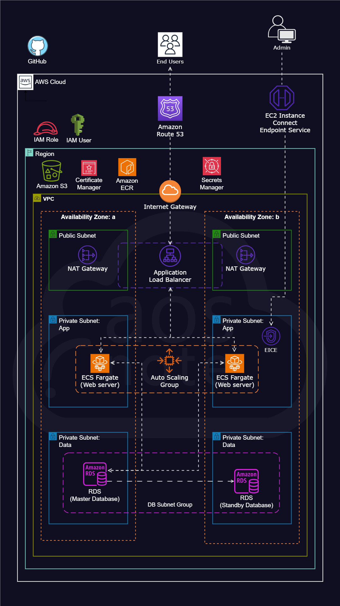

---

## Problem It Solved
This project addresses key challenges commonly found in traditional application deployments:

- **Lack of scalability** → Applications fail under increased traffic  
- **Single point of failure** → Downtime when a server crashes  
- **Security vulnerabilities** → Public databases and hardcoded credentials  
- **Manual infrastructure management** → High operational overhead  
- **Inconsistent environments** → Deployment failures across stages  

### ✅ Solution

To solve these, I designed a cloud-native architecture that:

- Uses **ECS Fargate** for serverless container orchestration  
- Implements **auto-scaling** based on CPU utilization  
- Secures sensitive data using **AWS Secrets Manager**  
- Deploys services in **private subnets** with controlled access  
- Ensures **high availability** using multi-AZ architecture and load balancing  

---

## Technologies Used

| Category | Tool/Service |
|---|---|
| Containerization | Docker, AWS ECR |
| Compute | Amazon ECS (Fargate) |
| Database | Amazon RDS (MySQL) |
| Networking | VPC, Subnets, Security Groups, ALB |
| Security | AWS Secrets Manager, IAM Roles |
| DNS & SSL | Route 53, ACM (SSL Certificate) |
| Monitoring | CloudWatch Container Insights |
| Storage | Amazon S3 |
| IaC/Scripting | PowerShell, Bash |
| Source Control | GitHub (Private Repo + Git LFS) |

---

## Infrastructure Breakdown & Decision Making

### 1. VPC & Network Design
Created a custom VPC with public and private subnets across two 
Availability Zones (AZ1 & AZ2).

**Why:** Placing the database and containers in private subnets means they 
are never directly exposed to the internet — only the Load Balancer sits 
in the public subnet. This follows the principle of least privilege at the 
network level.

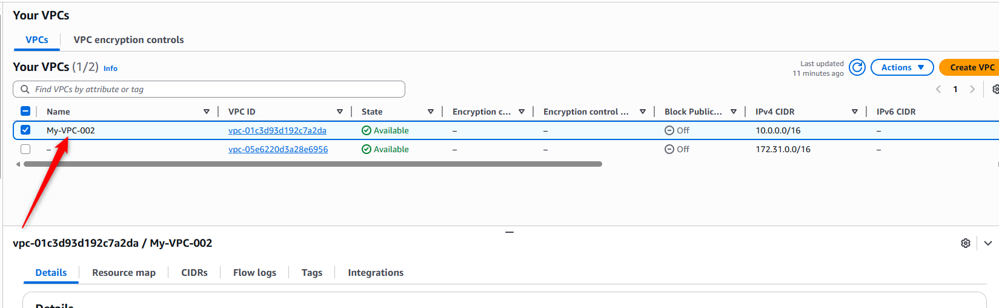
---

### 2. Security Groups
Configured four security groups with strict, least-privilege rules:

| Security Group | Inbound Rule | Source |
|---|---|---|
| ALB-SG | Port 80, 443 | Internet (0.0.0.0/0) |
| Container-SG | Port 80, 443 | ALB-SG only |
| DMS-SG | SSH | EICE-SG only |
| RDS-SG | Port 3306 (MySQL) | Container-SG, DMS-SG |

**Why:** Each layer only accepts traffic from the layer directly above it. 
The database never accepts traffic from the internet — only from the 
application containers and the migration server.

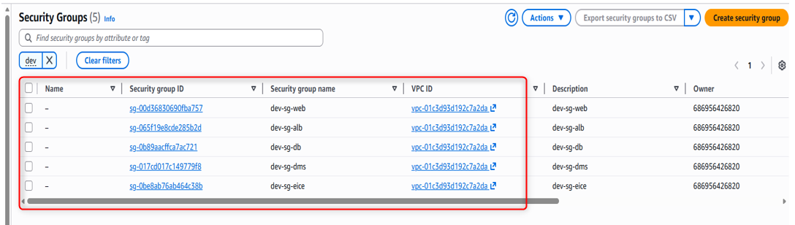
---

### 3. RDS MySQL Database
Created a managed MySQL database in a private subnet with an auto-generated 
password stored in AWS Secrets Manager.

**Why:** Using RDS instead of a self-managed database offloads patching, 
backups, and failover to AWS. Auto-generating the password and storing it 
in Secrets Manager means no human ever sees or handles the raw credentials.

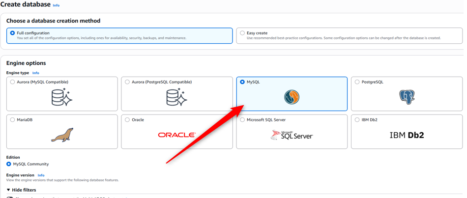

---

### 4. AWS Secrets Manager
Stored RDS credentials and GitHub Personal Access Token in Secrets Manager. 
Secrets are retrieved at runtime by the application and during Docker build.

**Why:** Hardcoding credentials in code or environment files is a major 
security risk — even in private repos. Secrets Manager provides encryption, 
audit logging, and automatic rotation capability.

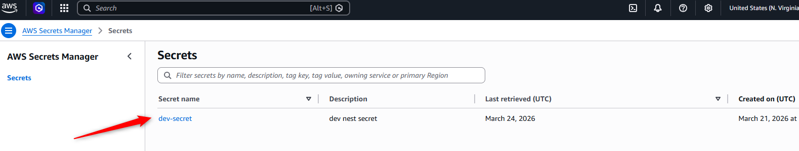
---

### 5. Data Migration Server (EC2)
Launched a private EC2 instance (no key pair) with a migration script in 
the user-data field and an IAM instance profile granting access to Secrets 
Manager and S3.

**Why:** Using EC2 Instance Connect Endpoint (EICE) instead of a key pair 
means no SSH keys to manage or leak. The IAM role follows least privilege — 
the instance only has the permissions it needs for migration, nothing more.

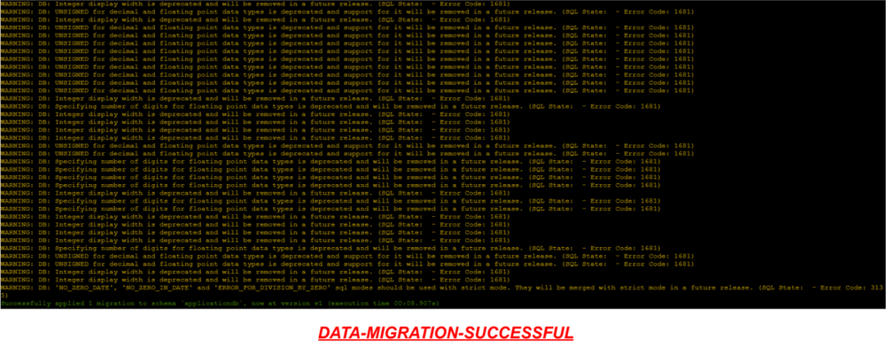
---
## 6. Store the Application Code in a private GitHub

The application code is stored in GitHub to serve as a **central source of truth**.
GitHub so that Docker can fetch the code, build it into a container image, and push it to ECR for deployment

This provides:
- **Version control & rollback:** track changes and revert when needed.  
- **Secure, centralized storage:** protects code from loss or local failures.  
- **Automation & deployment readiness:** enables pipelines to pull consistent code.  
- **Documentation & visibility:** allows recruiters and collaborators to review the project.  

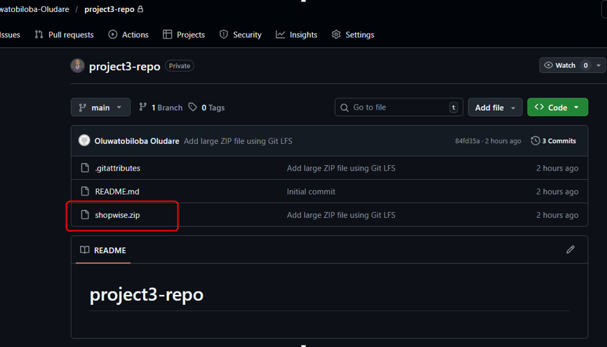

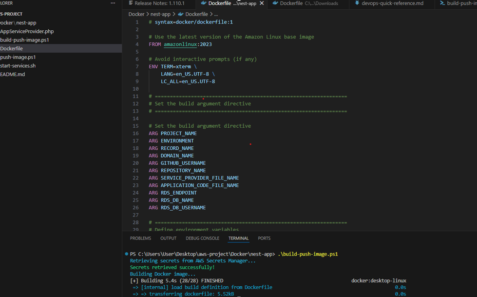

### 7. Docker & ECR
Built the Docker image using BuildKit secrets to inject the GitHub token 
and RDS password securely during the build — without baking them into 
image layers. Push the image to aws ecr.

**Why:** Docker build arguments are visible in image history. BuildKit 
secrets are mounted only during the build step and never stored in the 
final image, keeping credentials out of the container entirely.

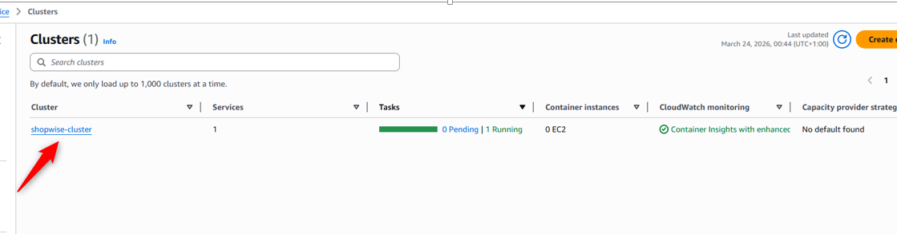

---

### 8. ECS Fargate (Serverless Containers)
Deployed the containerized application on ECS Fargate with the task running 
in private subnets, no public IP, behind the load balancer.

**Why:** Fargate removes the need to manage EC2 instances entirely. You 
define the task, and AWS handles the underlying infrastructure — reducing 
operational overhead significantly.

**IAM Roles created:**
- `ecs-task-execution-role` — allows ECS to pull images from ECR and write 
   logs to CloudWatch
- `ecs-task-role` — grants the running container access to S3, Secrets 
   Manager, SSM, and CloudWatch
- `ecs-infrastructure-role` — used by the load balancer integration

**Why separate roles:** Each role has only the permissions needed for its 
specific function. This limits blast radius if any role is ever compromised.

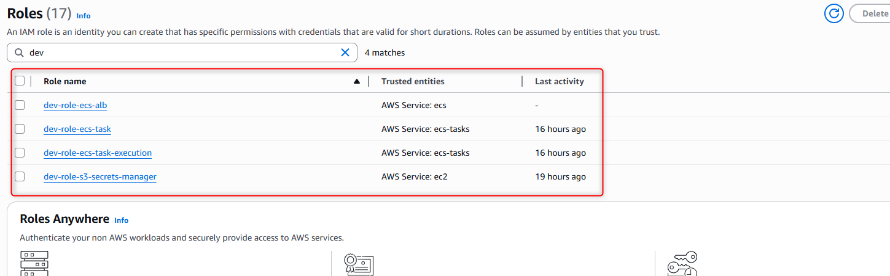
---

### 9. Application Load Balancer & HTTPS
Created an internet-facing ALB in public subnets with:
- HTTP (port 80) → redirects to HTTPS
- HTTPS (port 443) → forwards to ECS target group
- SSL certificate from AWS Certificate Manager (ACM)

**Why:** Redirecting HTTP to HTTPS ensures all traffic is encrypted in 
transit. Using ACM means SSL certificates are managed and auto-renewed 
by AWS — no manual certificate management.

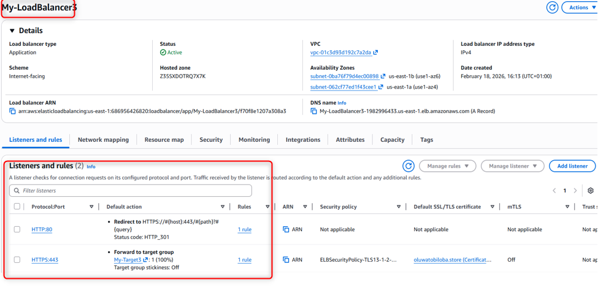

---

### 10. Auto-Scaling
Configured ECS Service Auto Scaling with:
- Min: 1 task | Max: 2 tasks
- Target tracking on `ECSServiceAverageCPUUtilization` at 70%
- Scale-out cooldown: 300s | Scale-in cooldown: 300s

**Why:** Auto-scaling ensures the application can handle traffic spikes 
automatically without manual intervention. The 70% CPU threshold gives 
headroom before the existing task becomes overwhelmed. Setting minimum 
to 1 keeps costs low during off-peak hours.

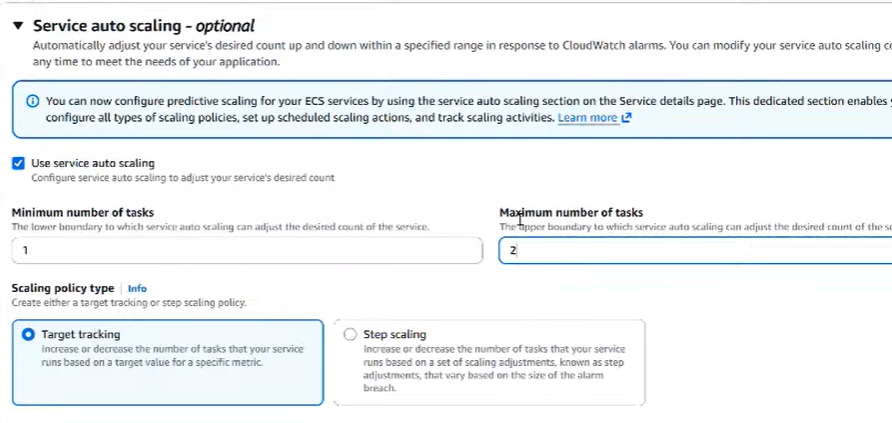
---

### 11. Route 53
Created an A record in the hosted zone pointing the custom domain to the 
ALB DNS name.

**Why:** Route 53 integrates natively with ALB using Alias records, which 
are free and automatically update if the ALB IP changes — unlike traditional 
DNS records. 

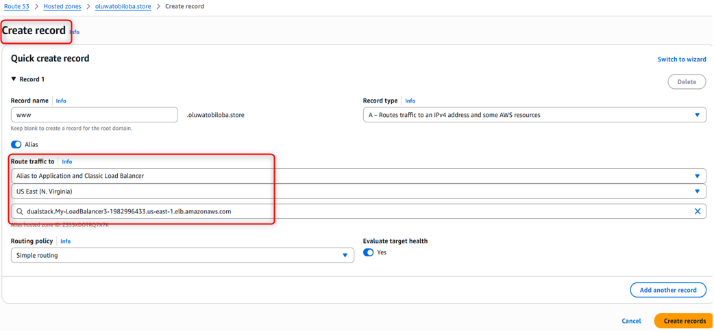

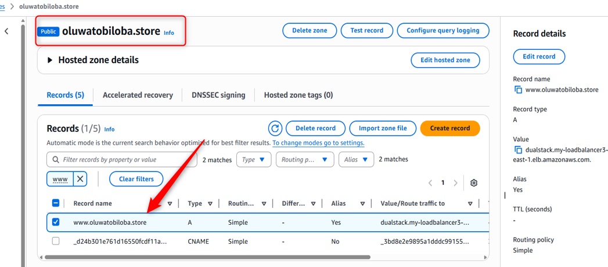

---

## Measurable Results
- ✅ Application successfully deployed and accessible via HTTPS on custom domain
- ✅ Zero credentials stored in code or Docker image layers
- ✅ Auto-scaling configured to handle CPU spikes up to 2x capacity automatically
- ✅ Database isolated in private subnet — zero direct internet exposure
- ✅ Full deployment reproducible via PowerShell script (build + push to ECR)
- ✅ High availability across 2 Availability Zones

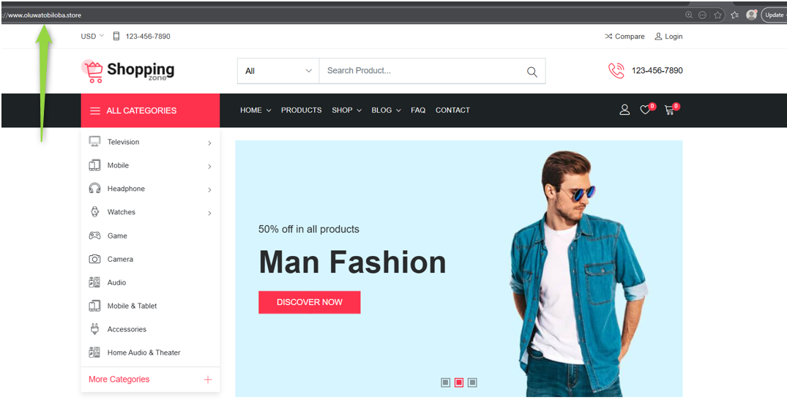
---

## Challenges & How I Solved Them

| Challenge | Solution |
|---|---|
| Docker build failing to clone from GitHub (DNS resolution error) | Switched from SSH to HTTPS cloning using PAT token injected via BuildKit secret |
| Image not appearing in ECR after push | Discovered mismatch between local image name (`nest`) and ECR repo name (`shopwise`) — fixed tagging command |
| Secret retrieval failing in PowerShell script | Found `$SECRET_NAME` was set to wrong value (`test` instead of `dev-secret`) — corrected variable |
| 117MB zip file too large for GitHub | Used Git LFS to handle large file, then removed it after confirming source code was already in GitHub |

---
## Future Improvements

### 1. Infrastructure as Code (Terraform / CloudFormation)
Currently the infrastructure was provisioned manually via the AWS Console.
The next step is to define the entire infrastructure as code using Terraform
so it can be versioned, peer-reviewed, and redeployed consistently across
environments (dev, staging, production) with a single command.

**Why it matters:** Manual console clicks are not repeatable or auditable.
IaC is the industry standard for production infrastructure.

---

### 2. CI/CD Pipeline (GitHub Actions)
Currently the Docker image is built and pushed manually by running a
PowerShell script locally. A CI/CD pipeline would automate this entire
process — on every push to the main branch, GitHub Actions would:
- Run tests
- Build the Docker image
- Push to ECR
- Deploy the new task to ECS automatically

**Why it matters:** Manual deployments are slow and error-prone.
Automated pipelines are a core DevOps expectation in any engineering team.

## Author
**Oluwatobiloba Oludare**
Cloud & DevOps Engineer
[GitHub](https://github.com/Oluwatobiloba-Oludare)
